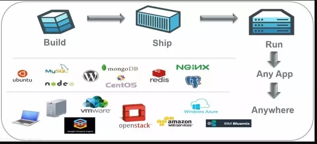
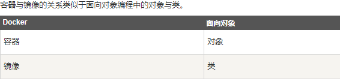
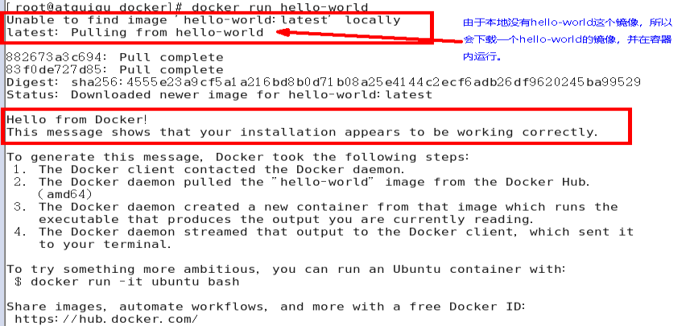
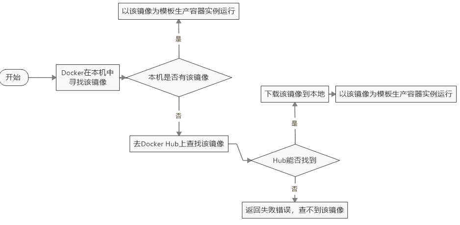
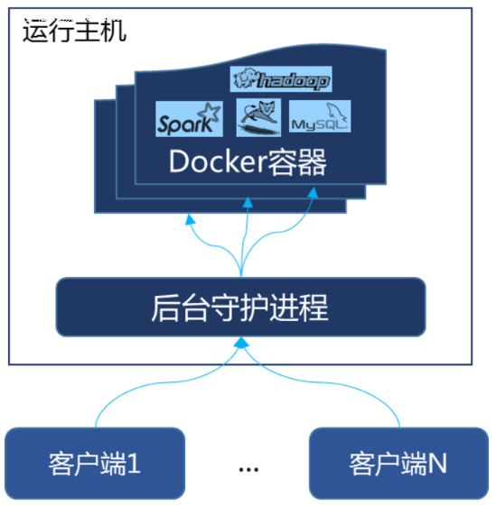
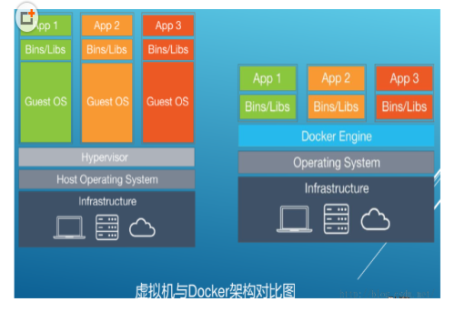
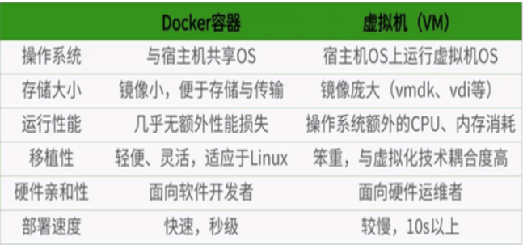
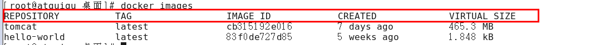
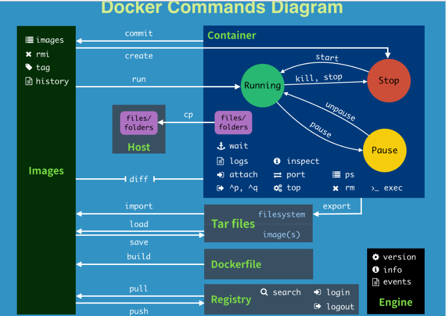

# docker的学习

## 1 docker简介

​	Docker是基于Go语言实现的云开源项目。
​	Docker的主要目标是“Build，Ship and Run Any App,Anywhere”，也就是通过对应用组件的封装、分发、部署、运行等生命周期的管理，使用户的APP（可以是一个WEB应用或数据库应用等等）及其运行环境能够做到“一次封装，到处运行”。



​	Linux 容器技术的出现就解决了这样一个问题，而 Docker 就是在它的基础上发展过来的。将应用运行在 Docker 容器上面，而 Docker 容器在任何操作系统上都是一致的，这就实现了跨平台、跨服务器。只需要一次配置好环境，换到别的机子上就可以一键部署好，大大简化了操作

### 1.1 docker下载

- Docker官网 http://www.docker.com
- Docker Hub官网: https://hub.docker.com/

## 2 docker安装

### 2.1 docker的基本组成

- 镜像

  Docker 镜像（Image）就是一个*只读*的模板。镜像可以用来创建 Docker 容器，**一个镜像可以创建很多容器**。

  

- 容器

  Docker 利用容器（Container）独立运行的一个或一组应用。**容器是用镜像创建的运行实例**。

  它可以被启动、开始、停止、删除。每个容器都是相互隔离的、保证安全的平台。

  可以把容器看做是一个简易版的 Linux 环境（包括root用户权限、进程空间、用户空间和网络空间等）和运行在其中的应用程序。

  容器的定义和镜像几乎一模一样，也是一堆层的统一视角，唯一区别在于容器的最上面那一层是可读可写的。

- 仓库

  **仓库（Repository）是集中存放镜像文件的场所**。
  仓库(Repository)和仓库注册服务器（Registry）是有区别的。仓库注册服务器上往往存放着多个仓库，每个仓库中又包含了多个镜像，每个镜像有不同的标签（tag）。

  仓库分为公开仓库（Public）和私有仓库（Private）两种形式。
  最大的公开仓库是 Docker Hub(https://hub.docker.com/)，
  存放了数量庞大的镜像供用户下载。国内的公开仓库包括阿里云 、网易云 等

### 2.2 docker安装

​	本文只针对CentOS7及以上版本安装，其他操作系统请自行百度

* 确认版本在CentOS7及以上版本 

```linux
cat /etc/redhat-release
```

* yum安装gcc相关

```LINUX
yum -y install gcc
yum -y install gcc-c++
```

* 卸载旧版本

```
yum -y remove docker docker-common docker-selinux docker-engine
```

- 安装需要的软件包

```
yum install -y yum-utils device-mapper-persistent-data lvm2
```

- 设置stable镜像仓库

```
yum-config-manager --add-repo http://mirrors.aliyun.com/docker-ce/linux/centos/docker-ce.repo
```

- 更新yum软件包索引

```
yum makecache fast
```

- 安装docker ce

```
yum -y install docker-ce
```

- 启动docker

```
systemctl start docker
```

- 测试

```
docker version
docker run hello-world
```

- 配置镜像加速

```
mkdir -p /etc/docker
vim  /etc/docker/daemon.json
systemctl daemon-reload
systemctl restart docker
```

### 2.3 镜像加速

​	本文只针对阿里云镜像加速，其余加速方式请自行百度

- 注册一个属于自己的阿里云账户(可复用淘宝账号)
- 获得加速器地址连接
  - 登陆阿里云开发者平台 https://promotion.aliyun.com/ntms/act/kubernetes.html
  - 获取加速器地址 点击容器镜像服务 ---> 镜像工具 ---> 镜像加速器
- 配置本机Docker运行镜像加速器

```shell
vim /etc/sysconfig/docker
   将获得的自己账户下的阿里云加速地址配置进
other_args="--registry-mirror=https://你自己的账号加速信息.mirror.aliyuncs.com"
```

- 重新启动Docker后台服务：service docker restart

- Linux 系统下配置完加速器需要检查是否生效

```sh
ps -ef | grep docker
//查看配置中的--registry-mirror参数确认配置是否成功
```

### 2.4 HelloWorld

​	启动docker后台容器，测运行hello-world

```shell
docker run hello-world
```



​		内部原理：



### 2.5 底层原理

- docker是怎么工作的

  ​	Docker是一个**Client-Server**结构的系统，Docker守护进程运行在主机上， 然后通过Socket连接从客户端访问，守护进程从客户端接受命令并管理运行在主机上的容器。 容器，是一个运行时环境，就是我们前面说到的集装箱。

  

- docker为什么比VM快

  - docker有着比虚拟机更少的抽象层。由于docker不需要Hypervisor实现硬件资源虚拟化,运行在docker容器上的程序直接使用的都是实际物理机的硬件资源。因此在CPU、内存利用率上docker将会在效率上有明显优势。

  - docker利用的是宿主机的内核,而不需要Guest OS。因此,当新建一个容器时,docker不需要和虚拟机一样重新加载一个操作系统内核。仍而避免引寻、加载操作系统内核返个比较费时费资源的过程,当新建一个虚拟机时,虚拟机软件需要加载Guest OS,返个新建过程是分钟级别的。而docker由于直接利用宿主机的操作系统,则省略了返个过程,因此新建一个docker容器只需要几秒钟。

  

  

## 3 docker常用命令

### 3.1 帮助命令

- `docker version`  查看docker的版本
- `docker info`  查看docker的信息
- `docker --help` docker的帮助信息

### 3.2 镜像命令

- `docker images` 列出当前主机上的镜像



| 列名       | 说明             |
| ---------- | ---------------- |
| REPOSITORY | 表示镜像的仓库源 |
| TAG        | 镜像的标签       |
| IMAGE ID   | 镜像ID           |
| CREATED    | 镜像创建时间     |
| SIZE       | 镜像大小         |

​	同一仓库源可以有多个 TAG，代表这个仓库源的不同个版本，我们使用 REPOSITORY:TAG 来定义不同的镜像。如果你不指定一个镜像的版本标签，例如你只使用 ubuntu，docker 将默认使用 ubuntu:latest 镜像

​	OPTIONS说明：

​		-a :列出本地所有的镜像（含中间映像层）

​		-q :只显示镜像ID。

​		--digests :显示镜像的摘要信息

​		--no-trunc :显示完整的镜像信息

- `docker search 某个XXX镜像名字`  查找xxx镜像

  `docker search [OPTIONS] 镜像名字`

  OPTIONS说明：

  ​	--no-trunc : 显示完整的镜像描述

  ​	-s : 列出收藏数不小于指定值的镜像

  ​	--automated : 只列出 automated build类型的镜像

- `docker pull 某个xxx镜像名字` 下载镜像

  `docker pull 镜像名字[:TAG]`

- `docker rmi 某个XXX镜像名字ID`  删除镜像

  - `docker rmi -f 镜像ID`  删除单个镜像
  - `docker rmi -f 镜像名1:TAG 镜像名2:TAG`  删除多个镜像
  - `docker rmi -f $(docker images -qa)`  删除全部镜像

### 3.3 容器命令

​	**有镜像才能创建容器，这是根本前提(下载一个CentOS镜像演示)**

 -  docker pull centos

 -  `docker run [OPTIONS] IMAGE [COMMAND] [ARG...]`  新建并启动容器

    OPTIONS说明：

    ​	--name="容器新名字": 为容器指定一个名称；
    ​    -d: 后台运行容器，并返回容器ID，也即启动守护式容器；
    ​	-i：以交互模式运行容器，通常与 -t 同时使用；
    ​	-t：为容器重新分配一个伪输入终端，通常与 -i 同时使用；
    ​	-P: 随机端口映射；
    ​	-p: 指定端口映射，有以下四种格式
    ​      	ip:hostPort:containerPort
    ​      	ip::containerPort
    ​      	hostPort:containerPort
    ​      	containerPort

- `docker ps [OPTIONS]`列出当前所有正在运行的容器

  OPTIONS说明：

  ​	-a :列出当前所有正在运行的容器+历史上运行过的
  ​	-l :显示最近创建的容器。
  ​	-n：显示最近n个创建的容器。
  ​	-q :静默模式，只显示容器编号。
  ​	--no-trunc :不截断输出。

- 退出容器

  - `exit`  容器停止退出
  - `ctrl + P + Q`  容器不停止退出

- `docker start 容器id或者容器名`  启动容器

- `docker restart 容器id或者容器名`  重启容器

- `docker stop 容器id或者容器名`  停止容器

- `docker kill 容器id或者容器名`  强制停止容器

- `docker rm 容器id`  删除已停止的容器

  - `docker rm -f $(docker ps -a -q)`

- `docker run -d 容器名`  启动守护式线程

- `docker logs -f -t --tail 容器id`  查看容器日志

- `docker top 容器id`  查看容器内运行的进程

- 进入正在运行的容器并以命令行交互

  - `docker exec -it 容器id bashshell`  在容器中打开新的终端，并且可以启动新线程
  - `docker attach 容器id`  直接进入容器启动命令的终端，不会启动新线程

- `docker cp 容器id:容器内路径 目的主机路径`

### 3.4 小结




