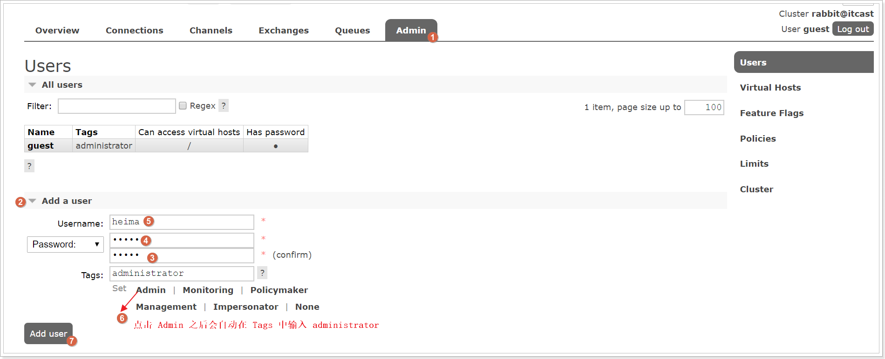
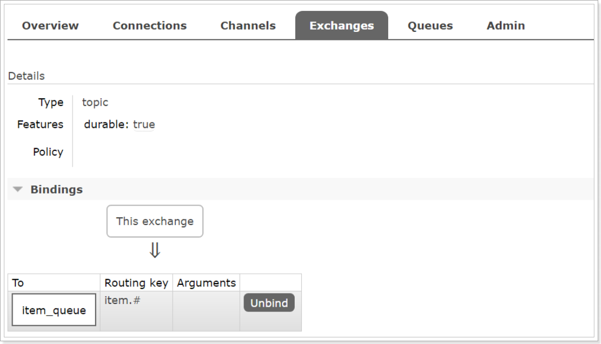
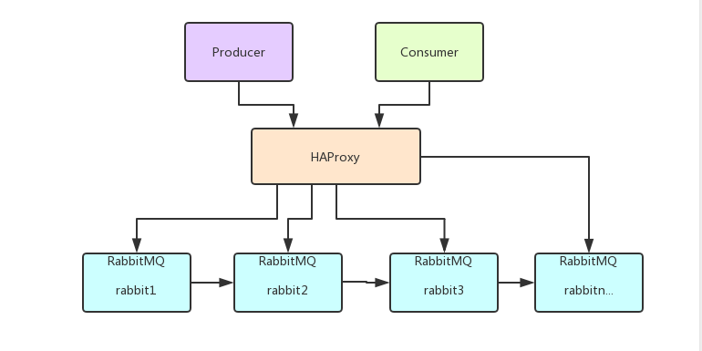

# RabbitMQ学习

## 1 MQ的基本概念

​	1. MQ全称 **Message Queue（消息队列）**，是在消息的传输过程中保存消息的容器。多用于分布式系统之间进行通信。


​	2. MQ概述小结：

  *   MQ，消息队列，存储消息的中间件

  *   分布式系统通信两种方式：直接远程调用 和 借助第三方完成间接通信

  *   发送方称为生产者，接收方称为消费者

      

    3. MQ的优势和劣势：

* 应用解耦：提高系统容错性和可维护性
* 异步提速：提高用户体验和系统吞吐量
* 削峰填谷：提高系统稳定性
* 系统可用性降低，系统复杂度提高，一致性问题


4. AMQP

   ​	**AMQP**，即 **Advanced Message Queuing Protocol**（高级消息队列协议），是一个网络协议，是应用层协议的一个开放标准，为面向消息的中间件设计。基于此协议的客户端与消息中间件可传递消息，并不受客户端/中间件不同产品，不同的开发语言等条件的限制。2006年，AMQP 规范发布。类比HTTP。

   

5. 基础架构

   ​	2007年，Rabbit 技术公司基于 AMQP 标准开发的 RabbitMQ 1.0 发布。RabbitMQ 采用 Erlang 语言开发。Erlang 语言由 Ericson 设计，专门为开发高并发和分布式系统的一种语言，在电信领域使用广泛。

   

   

6. 相关概念

- **Broker**：接收和分发消息的应用，RabbitMQ Server就是Message Broker
- **Virtual host**：出于多租户和安全因素设计的，把AMQP的基本组件划分到一个虚拟的分组中，类似于网络中的namespace概念。当多个不同的用户使用同一个RabbitMQ server提供的服务时，可以划分出多个vhost，每个用户再自己的vhost创建exchange/queue等
- **Connection**：publisher/consumer和broker之间的TCP连接
- **Channel**：如果每一次访问RabbitMQ都建立一个Connection，在消息量大的时候建立TCP Connection的开销时巨大的，效率也较低。Channel是在Connection内部建立的逻辑连接，如果应用程序支持多线程，通常每个thread创建单独的channel进行通讯，AMQP method包含channel id帮助客户端和message broker识别channel，所以channel之间是完全隔离的。channel作为轻量级的Connection极大减少了操作系统建立TCP connection的开销
- **Exchange**：message到达broker的第一站，根据分发规则，匹配查询表中的routing key，分发消息到queue中去。常用的类型有：**direct（点到点）**，**topic（订阅发布）**，**fanout（群发）**
- **Queue**：消息最终被送到这里等待consumer取走
- **Bingding**：Exchange和Queue之间的虚拟连接，bingding中可以包含routing key。Bingding信息被保存到Exchange的查询表中，用于message的分发依据


7. 工作模式

* 简单模式
* 工作队列（work queues）
* 发布订阅模式（publish/subscribe）
* 路由模式（routing）
* 主题模式（topic）
* 远程调用模式（RPC）


8. JMS

- **JMS** 即 Java 消息服务（JavaMessage Service）应用程序接口，是一个 Java 平台中关于面向消息中间件的API
- **JMS** 是 JavaEE 规范中的一种，类比JDBC
- 很多消息中间件都实现了JMS规范，例如：ActiveMQ。RabbitMQ 官方没有提供 JMS 的实现包，但是开源社区有

## 2 RabbitMQ的安装和配置

​	本文档只针对**CentOS7**的安装，其他操作系统请自行百度

1. 安装依赖环境

   ```shell
   yum install build-essential openssl openssl-devel unixODBC unixODBC-devel make gcc gcc-c++ kernel-devel m4 ncurses-devel tk tc xz
   ```

2. 安装Erlang

   上传erlang-18.3-1.el7.centos.x86_64.rpm，socat-1.7.3.2-5.el7.lux.x86_64.rpm，rabbitmq-server-3.6.5-1.noarch.rpm

   ```shell
   # 安装
   rpm -ivh erlang-18.3-1.el7.centos.x86_64.rpm
   ```

   如果出现以下错误

   

   说明gblic 版本太低。我们可以查看当前机器的gblic 版本

   ```
   strings /lib64/libc.so.6 | grep GLIBC
   ```

   

   当前最高版本2.12，需要2.15.所以需要升级glibc

   - 使用yum更新安装依赖

   ```shell
   sudo yum install zlib-devel bzip2-devel openssl-devel ncurses-devel sqlite-devel readline-devel tk-devel gcc make -y
   ```

   - 下载rpm包

   ```shell
   wget http://copr-be.cloud.fedoraproject.org/results/mosquito/myrepo-el6/epel-6-x86_64/glibc-2.17-55.fc20/glibc-utils-2.17-55.el6.x86_64.rpm &
   wget http://copr-be.cloud.fedoraproject.org/results/mosquito/myrepo-el6/epel-6-x86_64/glibc-2.17-55.fc20/glibc-static-2.17-55.el6.x86_64.rpm &
   wget http://copr-be.cloud.fedoraproject.org/results/mosquito/myrepo-el6/epel-6-x86_64/glibc-2.17-55.fc20/glibc-2.17-55.el6.x86_64.rpm &
   wget http://copr-be.cloud.fedoraproject.org/results/mosquito/myrepo-el6/epel-6-x86_64/glibc-2.17-55.fc20/glibc-common-2.17-55.el6.x86_64.rpm &
   wget http://copr-be.cloud.fedoraproject.org/results/mosquito/myrepo-el6/epel-6-x86_64/glibc-2.17-55.fc20/glibc-devel-2.17-55.el6.x86_64.rpm &
   wget http://copr-be.cloud.fedoraproject.org/results/mosquito/myrepo-el6/epel-6-x86_64/glibc-2.17-55.fc20/glibc-headers-2.17-55.el6.x86_64.rpm &
   wget http://copr-be.cloud.fedoraproject.org/results/mosquito/myrepo-el6/epel-6-x86_64/glibc-2.17-55.fc20/nscd-2.17-55.el6.x86_64.rpm &
   ```

   - 安装rpm包

   ```
   sudo rpm -Uvh *-2.17-55.el6.x86_64.rpm --force --nodeps
   ```

   - 安装完毕后再查看glibc版本,发现glibc版本已经到2.17了

   ```shell
   strings /lib64/libc.so.6 | grep GLIBC
   ```

   

3. 安装RabbitMQ

```sh
# 安装
rpm -ivh socat-1.7.3.2-5.el7.lux.x86_64.rpm

# 安装
rpm -ivh rabbitmq-server-3.6.5-1.noarch.rpm
```

4. 开启管理界面及配置

```
# 开启管理界面
rabbitmq-plugins enable rabbitmq_management
# 修改默认配置信息
vim /usr/lib/rabbitmq/lib/rabbitmq_server-3.6.5/ebin/rabbit.app 
# 比如修改密码、配置等等，例如：loopback_users 中的 <<"guest">>,只保留guest
```

5. 启动

```
service rabbitmq-server start # 启动服务
service rabbitmq-server stop # 停止服务
service rabbitmq-server restart # 重启服务
```

	* 设置配置文件

```shell
cd /usr/share/doc/rabbitmq-server-3.6.5/

cp rabbitmq.config.example /etc/rabbitmq/rabbitmq.config
```

6. 配置虚拟主机和用户

   6.1. 用户角色

   ​	RabbitMQ在安装好后，可以访问`http://ip地址:15672` ；其自带了guest/guest的用户名和密码；如果需要创建自定义用户；那么也可以登录管理界面后，如下操作：

   

   

   

   **角色说明**：

   1、 超级管理员(administrator)

   可登陆管理控制台，可查看所有的信息，并且可以对用户，策略(policy)进行操作。

   2、 监控者(monitoring)

   可登陆管理控制台，同时可以查看rabbitmq节点的相关信息(进程数，内存使用情况，磁盘使用情况等)

   3、 策略制定者(policymaker)

   可登陆管理控制台, 同时可以对policy进行管理。但无法查看节点的相关信息(上图红框标识的部分)。

   4、 普通管理者(management)

   仅可登陆管理控制台，无法看到节点信息，也无法对策略进行管理。

   5、 其他

   无法登陆管理控制台，通常就是普通的生产者和消费者。

   

   6.2. Virtual Hosts配置

    	像mysql拥有数据库的概念并且可以指定用户对库和表等操作的权限。RabbitMQ也有类似的权限管理；在RabbitMQ中可以虚拟消息服务器Virtual Host，每个Virtual Hosts相当于一个相对独立的RabbitMQ服务器，每个VirtualHost之间是相互隔离的。exchange、queue、message不能互通。 相当于mysql的db。Virtual Name一般以/开头。

   - 创建Virtual Hosts

   

   - 设置Virtual Host权限

   

   

## 3 RabbitMQ入门

[请看这里](./讲义/RabbitMQ 讲义.md)

### 3.1 简单模式

​	①创建工程（生成者、消费者）

​	②分别添加依赖

​	③编写生产者发送消息

​	④编写消费者接收消息


[简单模式生产者代码](./rabbitmq-producer/src/main/java/com/itcast/producer/HelloWorld.java)

[简单模式消费者代码](./rabbitmq-consumer/src/main/java/com/itcast/producer/Helloworld.java)

​	在上图模型中，有以下概念：

- P：生产者，也就是要发送消息的程序
- C：消费者，消息的接收者，会一直等待消息的到来
- queue：消息队列，图中红色部分。类似一个邮箱，可以缓存消息，生产者从中投递消息，消费者从其中取出消息。

## 4 RabbitMQ工作模式

[工作模式生产者代码](./rabbitmq-producer/src/main/java/com/itcast/producer)

[工作模式消费者代码](./rabbitmq-consumer/src/main/java/com/itcast/consumer)

### 4.1 work queue工作队列模式


- work queues：与上面的简单模式相比，多了一个消费端，多个消费端共同消费同一个队列的信息。

- 应用场景：对于任务过重或任务较多情况使用工作队列可以提高任务处理的速度。

### 4.2 pub/sub 订阅模式


​	在订阅模型中，多了一个Exchange角色，而且过程略有变化：

- P：生产者，也就是要发送消息的程序，但是不再发送到队列中，而是发给X（交换机）

- C：消费者，消息的接收者，会一直等待消息到来

- Queue：消息队列，接收消息，缓存消息

- Exchange：交换机（X）。一方面，接收生产者发送的消息，另一方面，知道如何处理消息。例如递交给某个特别队列，递交给所有队列、或是将消息丢弃。到底如何操作，取决于Exchange的类型。Exchange有常见如下3种类型：

  - Fanout：广播，将消息交给所有绑定到交换机的队列。
  - Direct：定向，把消息交给符合指定routing key的队列
  - Topic：通配符，把消息交给符合routing key（路由模式）的队列

  Exchange（交换机）只负责转发消息，不负责存储消息的能力，因此如果没有任何队列和Exchange绑定，或者没有符合路由规则的队列，那么消息会丢失。

### 4.3 routing 路由模式

- 队列和交换机的绑定，不再是任意绑定了，而是要指定一个RoutingKey（路由key）
- 消息的发送方在向Exchange发送消息时，也必须指定消息的RoutingKey
- Exchange不再把消息交给每一个绑定的队列，而是根据消息的Routing key进行判断，只有队列的Routingkey与消息的Routing key完全一致，才会接收到消息


- P：生产者，向Exchange发送消息，发送消息时，会指定一个routing key
- X：Exchange（交换机），接收生产者的消息，然后把消息递交给与routing key完全匹配的队列
- C1：消费者，其所在队列指定了需要routing key为error的消息
- C2：消费者，其所在队列指定了需要routing key为info、error、warning的消息

### 4.4 Topics 通配符模式

- Topic类型与Direct相比，都是可以根据RoutingKey把消息路由到不同的队列。只不过Topic类型Exchange可以让队列在绑定Routing key的时候使用通配符！
- Routingkey一般都是有一个或多个单词组成，多个单词之间以“.”分割，例如：item.insert
- 通配符规则：#匹配一个或多个词，*匹配不多不少恰好1个词，如何：item.#能够匹配item.insert.abc或者item.insert，item.\*只能匹配item.insert


- 红色Queue：绑定的是usa.#，因此凡是以usa.开头的routing key都会被匹配
- 黄色Queue：绑定的是#.news，因此凡事以.news结尾的routing key都会被匹配

### 4.5 工作模式总结

- 简单模式 HelloWorld

  一个生产者，一个消费者，不需要设置交换机（使用默认的交换机）。

- 工作队列模式 Work Queue

  一个生产者，多个消费者（竞争关系），不需要设置交换机（使用默认的交换机）。

- 发布订阅模式 publish/subscribe

  需要设置类型为fanount的交换机，并且交换机和队列进行绑定，当发送消息到交换机后，交换机会将消息发送到绑定的队列

- 路由模式 routing

  需要设置类型为direct的交换机，交换机和队列进行绑定，并且指定routing key，当发送消息到交换机后，交换机会根据routing key将消息发送到对应的队列。

- 通配符模式 Topic

  需要设置类型为topic的交换机，交换机和队列进行绑定，并且指定通配符方式的routing key，当发送消息到交换机后，交换机会根据routing key将消息发送到对应的队列。

## 5 Spring整合RabbitMq

### 5.1 搭建生产者工程

#### 5.1.1 创建工程

​	创建一个maven工程

#### 5.1.2 添加依赖

```java
    <dependencies>
        <dependency>
            <groupId>org.springframework</groupId>
            <artifactId>spring-context</artifactId>
            <version>5.1.7.RELEASE</version>
        </dependency>

        <dependency>
            <groupId>org.springframework.amqp</groupId>
            <artifactId>spring-rabbit</artifactId>
            <version>2.1.8.RELEASE</version>
        </dependency>

        <!--测试依赖-->
        <dependency>
            <groupId>junit</groupId>
            <artifactId>junit</artifactId>
            <version>4.12</version>
        </dependency>

        <dependency>
            <groupId>org.springframework</groupId>
            <artifactId>spring-test</artifactId>
            <version>5.1.7.RELEASE</version>
        </dependency>
    </dependencies>
```

#### 5.1.3 配置整合

- 创建rabbitmq.properties连接参数等配置文件

```properties
rabbitmq.host=
rabbitmq.port=5672
rabbitmq.username=
rabbitmq.password=
rabbitmq.virtual-host=
```

- 创建spring-rabbitmq.xml整合配置文件

```xml
<?xml version="1.0" encoding="UTF-8"?>
<beans xmlns="http://www.springframework.org/schema/beans"
       xmlns:xsi="http://www.w3.org/2001/XMLSchema-instance"
       xmlns:context="http://www.springframework.org/schema/context"
       xmlns:rabbit="http://www.springframework.org/schema/rabbit"
       xsi:schemaLocation="http://www.springframework.org/schema/beans
       http://www.springframework.org/schema/beans/spring-beans.xsd
       http://www.springframework.org/schema/context
       https://www.springframework.org/schema/context/spring-context.xsd
       http://www.springframework.org/schema/rabbit
       http://www.springframework.org/schema/rabbit/spring-rabbit.xsd">
    <!--加载配置文件-->
    <context:property-placeholder location="classpath:properties/rabbitmq.properties"/>

    <!-- 定义rabbitmq connectionFactory -->
    <rabbit:connection-factory id="connectionFactory" host="${rabbitmq.host}"
                               port="${rabbitmq.port}"
                               username="${rabbitmq.username}"
                               password="${rabbitmq.password}"
                               virtual-host="${rabbitmq.virtual-host}"/>
    <!--定义管理交换机、队列-->
    <rabbit:admin connection-factory="connectionFactory"/>

    <!--定义持久化队列，不存在则自动创建；不绑定到交换机则绑定到默认交换机
    默认交换机类型为direct，名字为：""，路由键为队列的名称
    -->
    <rabbit:queue id="spring_queue" name="spring_queue" auto-declare="true"/>

    <!-- ~~~~~~~~~~~~~~~~~~~~~~~~~~~~广播；所有队列都能收到消息~~~~~~~~~~~~~~~~~~~~~~~~~~~~ -->
    <!--定义广播交换机中的持久化队列，不存在则自动创建-->
    <rabbit:queue id="spring_fanout_queue_1" name="spring_fanout_queue_1" auto-declare="true"/>

    <!--定义广播交换机中的持久化队列，不存在则自动创建-->
    <rabbit:queue id="spring_fanout_queue_2" name="spring_fanout_queue_2" auto-declare="true"/>

    <!--定义广播类型交换机；并绑定上述两个队列-->
    <rabbit:fanout-exchange id="spring_fanout_exchange" name="spring_fanout_exchange" auto-declare="true">
        <rabbit:bindings>
            <rabbit:binding queue="spring_fanout_queue_1"/>
            <rabbit:binding queue="spring_fanout_queue_2"/>
        </rabbit:bindings>
    </rabbit:fanout-exchange>

    <!-- ~~~~~~~~~~~~~~~~~~~~~~~~~~~~通配符；*匹配一个单词，#匹配多个单词 ~~~~~~~~~~~~~~~~~~~~~~~~~~~~ -->
    <!--定义广播交换机中的持久化队列，不存在则自动创建-->
    <rabbit:queue id="spring_topic_queue_star" name="spring_topic_queue_star" auto-declare="true"/>
    <!--定义广播交换机中的持久化队列，不存在则自动创建-->
    <rabbit:queue id="spring_topic_queue_well" name="spring_topic_queue_well" auto-declare="true"/>
    <!--定义广播交换机中的持久化队列，不存在则自动创建-->
    <rabbit:queue id="spring_topic_queue_well2" name="spring_topic_queue_well2" auto-declare="true"/>

    <rabbit:topic-exchange id="spring_topic_exchange" name="spring_topic_exchange" auto-declare="true">
        <rabbit:bindings>
            <rabbit:binding pattern="heima.*" queue="spring_topic_queue_star"/>
            <rabbit:binding pattern="heima.#" queue="spring_topic_queue_well"/>
            <rabbit:binding pattern="itcast.#" queue="spring_topic_queue_well2"/>
        </rabbit:bindings>
    </rabbit:topic-exchange>

    <!--定义rabbitTemplate对象操作可以在代码中方便发送消息-->
    <rabbit:template id="rabbitTemplate" connection-factory="connectionFactory"/>
</beans>
```

#### 5.1.4 发送消息

​	创建测试文件ProducerTest.java

```java
@RunWith(SpringJUnit4ClassRunner.class)
@ContextConfiguration(locations = "classpath:spring/spring-rabbitmq.xml")
public class ProducerTest {

    @Autowired
    private RabbitTemplate rabbitTemplate;

    /**
     * 只发队列消息
     * 默认交换机类型为 direct
     * 交换机的名称为空，路由键为队列的名称
     */
    @Test
    public void queueTest(){
        //路由键与队列同名
        rabbitTemplate.convertAndSend("spring_queue", "只发队列spring_queue的消息。");
    }

    /**
     * 发送广播
     * 交换机类型为 fanout
     * 绑定到该交换机的所有队列都能够收到消息
     */
    @Test
    public void fanoutTest(){
        /**
         * 参数1：交换机名称
         * 参数2：路由键名（广播设置为空）
         * 参数3：发送的消息内容
         */
        rabbitTemplate.convertAndSend("spring_fanout_exchange", "", "发送到spring_fanout_exchange交换机的广播消息");
    }

    /**
     * 通配符
     * 交换机类型为 topic
     * 匹配路由键的通配符，*表示一个单词，#表示多个单词
     * 绑定到该交换机的匹配队列能够收到对应消息
     */
    @Test
    public void topicTest(){
        /**
         * 参数1：交换机名称
         * 参数2：路由键名
         * 参数3：发送的消息内容
         */
        rabbitTemplate.convertAndSend("spring_topic_exchange", "heima.bj", "发送到spring_topic_exchange交换机heima.bj的消息");
        rabbitTemplate.convertAndSend("spring_topic_exchange", "heima.bj.1", "发送到spring_topic_exchange交换机heima.bj.1的消息");
        rabbitTemplate.convertAndSend("spring_topic_exchange", "heima.bj.2", "发送到spring_topic_exchange交换机heima.bj.2的消息");
        rabbitTemplate.convertAndSend("spring_topic_exchange", "itcast.cn", "发送到spring_topic_exchange交换机itcast.cn的消息");
    }
}
```

### 5.2 搭建消费者工程

#### 5.2.1 创建工作

​	创建一个maven项目

#### 5.2.2 添加依赖

```xml
        <dependency>
            <groupId>org.springframework</groupId>
            <artifactId>spring-context</artifactId>
            <version>5.1.7.RELEASE</version>
        </dependency>

        <dependency>
            <groupId>org.springframework.amqp</groupId>
            <artifactId>spring-rabbit</artifactId>
            <version>2.1.8.RELEASE</version>
        </dependency>
```

#### 5.2.3 配置整合

​	创建spring-rabbitmq.xml整合配置文件

```xml
<?xml version="1.0" encoding="UTF-8"?>
<beans xmlns="http://www.springframework.org/schema/beans"
       xmlns:xsi="http://www.w3.org/2001/XMLSchema-instance"
       xmlns:context="http://www.springframework.org/schema/context"
       xmlns:rabbit="http://www.springframework.org/schema/rabbit"
       xsi:schemaLocation="http://www.springframework.org/schema/beans
       http://www.springframework.org/schema/beans/spring-beans.xsd
       http://www.springframework.org/schema/context
       https://www.springframework.org/schema/context/spring-context.xsd
       http://www.springframework.org/schema/rabbit
       http://www.springframework.org/schema/rabbit/spring-rabbit.xsd">
    <!--加载配置文件-->
    <context:property-placeholder location="classpath:properties/rabbitmq.properties"/>

    <!-- 定义rabbitmq connectionFactory -->
    <rabbit:connection-factory id="connectionFactory" host="${rabbitmq.host}"
                               port="${rabbitmq.port}"
                               username="${rabbitmq.username}"
                               password="${rabbitmq.password}"
                               virtual-host="${rabbitmq.virtual-host}"/>

    <bean id="springQueueListener" class="com.itheima.rabbitmq.listener.SpringQueueListener"/>
    <bean id="fanoutListener1" class="com.itheima.rabbitmq.listener.FanoutListener1"/>
    <bean id="fanoutListener2" class="com.itheima.rabbitmq.listener.FanoutListener2"/>
    <bean id="topicListenerStar" class="com.itheima.rabbitmq.listener.TopicListenerStar"/>
    <bean id="topicListenerWell" class="com.itheima.rabbitmq.listener.TopicListenerWell"/>
    <bean id="topicListenerWell2" class="com.itheima.rabbitmq.listener.TopicListenerWell2"/>

    <rabbit:listener-container connection-factory="connectionFactory" auto-declare="true">
        <rabbit:listener ref="springQueueListener" queue-names="spring_queue"/>
        <rabbit:listener ref="fanoutListener1" queue-names="spring_fanout_queue_1"/>
        <rabbit:listener ref="fanoutListener2" queue-names="spring_fanout_queue_2"/>
        <rabbit:listener ref="topicListenerStar" queue-names="spring_topic_queue_star"/>
        <rabbit:listener ref="topicListenerWell" queue-names="spring_topic_queue_well"/>
        <rabbit:listener ref="topicListenerWell2" queue-names="spring_topic_queue_well2"/>
    </rabbit:listener-container>
</beans>
```

#### 5.2.4 消息监听器

##### 1）队列监听器

创建`SpringQueueListener.java`

```java
public class SpringQueueListener implements MessageListener {
    public void onMessage(Message message) {
        try {
            String msg = new String(message.getBody(), "utf-8");

            System.out.printf("接收路由名称为：%s，路由键为：%s，队列名为：%s的消息：%s \n",
                    message.getMessageProperties().getReceivedExchange(),
                    message.getMessageProperties().getReceivedRoutingKey(),
                    message.getMessageProperties().getConsumerQueue(),
                    msg);
        } catch (Exception e) {
            e.printStackTrace();
        }
    }
}
```


##### 2）广播监听器1

创建`FanoutListener1.java`

```java
public class FanoutListener1 implements MessageListener {
    public void onMessage(Message message) {
        try {
            String msg = new String(message.getBody(), "utf-8");

            System.out.printf("广播监听器1：接收路由名称为：%s，路由键为：%s，队列名为：%s的消息：%s \n",
                    message.getMessageProperties().getReceivedExchange(),
                    message.getMessageProperties().getReceivedRoutingKey(),
                    message.getMessageProperties().getConsumerQueue(),
                    msg);
        } catch (Exception e) {
            e.printStackTrace();
        }
    }
}

```

##### 3）广播监听器2

创建`FanoutListener2.java`

```java
public class FanoutListener2 implements MessageListener {
    public void onMessage(Message message) {
        try {
            String msg = new String(message.getBody(), "utf-8");

            System.out.printf("广播监听器2：接收路由名称为：%s，路由键为：%s，队列名为：%s的消息：%s \n",
                    message.getMessageProperties().getReceivedExchange(),
                    message.getMessageProperties().getReceivedRoutingKey(),
                    message.getMessageProperties().getConsumerQueue(),
                    msg);
        } catch (Exception e) {
            e.printStackTrace();
        }
    }
}
```

##### 4）星号通配符监听器

创建`TopicListenerStar.java`

```java
public class TopicListenerStar implements MessageListener {
    public void onMessage(Message message) {
        try {
            String msg = new String(message.getBody(), "utf-8");

            System.out.printf("通配符*监听器：接收路由名称为：%s，路由键为：%s，队列名为：%s的消息：%s \n",
                    message.getMessageProperties().getReceivedExchange(),
                    message.getMessageProperties().getReceivedRoutingKey(),
                    message.getMessageProperties().getConsumerQueue(),
                    msg);
        } catch (Exception e) {
            e.printStackTrace();
        }
    }
}

```

##### 5）井号通配符监听器

创建`TopicListenerWell.java`

```java
public class TopicListenerWell implements MessageListener {
    public void onMessage(Message message) {
        try {
            String msg = new String(message.getBody(), "utf-8");

            System.out.printf("通配符#监听器：接收路由名称为：%s，路由键为：%s，队列名为：%s的消息：%s \n",
                    message.getMessageProperties().getReceivedExchange(),
                    message.getMessageProperties().getReceivedRoutingKey(),
                    message.getMessageProperties().getConsumerQueue(),
                    msg);
        } catch (Exception e) {
            e.printStackTrace();
        }
    }
}

```

##### 6）井号通配符监听器2

创建`TopicListenerWell2.java`

```java
public class TopicListenerWell2 implements MessageListener {
    public void onMessage(Message message) {
        try {
            String msg = new String(message.getBody(), "utf-8");

            System.out.printf("通配符#监听器2：接收路由名称为：%s，路由键为：%s，队列名为：%s的消息：%s \n",
                    message.getMessageProperties().getReceivedExchange(),
                    message.getMessageProperties().getReceivedRoutingKey(),
                    message.getMessageProperties().getConsumerQueue(),
                    msg);
        } catch (Exception e) {
            e.printStackTrace();
        }
    }
}
```

## 6 SpringBoot整合RabbitMQ

### 6.1 搭建生产者工程

#### 6.1.1 创建工程

创建生产者工程springboot-rabbitmq-producer

####  6.1.2 添加依赖

修改pom.xml文件：

```xml
        <dependency>
            <groupId>org.springframework.boot</groupId>
            <artifactId>spring-boot-starter-amqp</artifactId>
        </dependency>
        <dependency>
            <groupId>org.springframework.boot</groupId>
            <artifactId>spring-boot-starter-test</artifactId>
        </dependency>
```


####  6.1.3 启动类

```java
package com.itheima.rabbitmq;

import org.springframework.boot.SpringApplication;
import org.springframework.boot.autoconfigure.SpringBootApplication;

@SpringBootApplication
public class ProducerApplication {
    public static void main(String[] args) {
        SpringApplication.run(ProducerApplication.class, args);
    }
}

```


####  6.1.4 配置RabbitMQ

##### 1）配置文件

创建application.yml，内容如下：

```yml
spring:
  rabbitmq:
    host: localhost
    port: 5672
    virtual-host: 
    username: 
    password: 
```


##### 2）绑定交换机和队列

创建RabbitMQ队列与交换机绑定的配置类com.itheima.rabbitmq.config.RabbitMQConfig

```java
package com.itheima.rabbitmq.config;

import org.springframework.amqp.core.*;
import org.springframework.beans.factory.annotation.Qualifier;
import org.springframework.context.annotation.Bean;
import org.springframework.context.annotation.Configuration;

@Configuration
public class RabbitMQConfig {
    //交换机名称
    public static final String ITEM_TOPIC_EXCHANGE = "item_topic_exchange";
    //队列名称
    public static final String ITEM_QUEUE = "item_queue";

    //声明交换机
    @Bean("itemTopicExchange")
    public Exchange topicExchange(){
        return ExchangeBuilder.topicExchange(ITEM_TOPIC_EXCHANGE).durable(true).build();
    }

    //声明队列
    @Bean("itemQueue")
    public Queue itemQueue(){
        return QueueBuilder.durable(ITEM_QUEUE).build();
    }

    //绑定队列和交换机
    @Bean
    public Binding itemQueueExchange(@Qualifier("itemQueue") Queue queue,
                                     @Qualifier("itemTopicExchange") Exchange exchange){
        return BindingBuilder.bind(queue).to(exchange).with("item.#").noargs();
    }

}
```

### 6.2 搭建消费者工程

####  6.2.1 创建工程

创建消费者工程springboot-rabbitmq-consumer

#### 6.2.2 添加依赖

修改pom.xml文件内容为如下：

```xml
        <dependency>
            <groupId>org.springframework.boot</groupId>
            <artifactId>spring-boot-starter-amqp</artifactId>
        </dependency>
```

####  6.2.3 启动类

```java
package com.itheima.rabbitmq;

import org.springframework.boot.SpringApplication;
import org.springframework.boot.autoconfigure.SpringBootApplication;

@SpringBootApplication
public class ConsumerApplication {
    public static void main(String[] args) {
        SpringApplication.run(ConsumerApplication.class);
    }
}
```


#### 6.2.4 配置RabbitMQ

创建application.yml，内容如下：

```yml
spring:
  rabbitmq:
    host: 
    port: 5672
    virtual-host: 
    username: 
    password: 
```


#### 6.2.5 消息监听处理类

编写消息监听器com.itheima.rabbitmq.listener.MyListener

```java
package com.itheima.rabbitmq.listener;

import org.springframework.amqp.rabbit.annotation.RabbitListener;
import org.springframework.stereotype.Component;

@Component
public class MyListener {

    /**
     * 监听某个队列的消息
     * @param message 接收到的消息
     */
    @RabbitListener(queues = "item_queue")
    public void myListener1(String message){
        System.out.println("消费者接收到的消息为：" + message);
    }
}

```


### 6.3 测试

在生产者工程springboot-rabbitmq-producer中创建测试类，发送消息：

```java
package com.itheima.rabbitmq;

import com.itheima.rabbitmq.config.RabbitMQConfig;
import org.junit.Test;
import org.junit.runner.RunWith;
import org.springframework.amqp.rabbit.core.RabbitTemplate;
import org.springframework.beans.factory.annotation.Autowired;
import org.springframework.boot.test.context.SpringBootTest;
import org.springframework.test.context.junit4.SpringRunner;

@RunWith(SpringRunner.class)
@SpringBootTest
public class RabbitMQTest {

    @Autowired
    private RabbitTemplate rabbitTemplate;

    @Test
    public void test(){
        rabbitTemplate.convertAndSend(RabbitMQConfig.ITEM_TOPIC_EXCHANGE, "item.insert", "商品新增，routing key 为item.insert");
        rabbitTemplate.convertAndSend(RabbitMQConfig.ITEM_TOPIC_EXCHANGE, "item.update", "商品修改，routing key 为item.update");
        rabbitTemplate.convertAndSend(RabbitMQConfig.ITEM_TOPIC_EXCHANGE, "item.delete", "商品删除，routing key 为item.delete");
    }
}
```


先运行上述测试程序（交换机和队列才能先被声明和绑定），然后启动消费者；在消费者工程springboot-rabbitmq-consumer中控制台查看是否接收到对应消息。


另外；也可以在RabbitMQ的管理控制台中查看到交换机与队列的绑定：




## 7 RabbitMQ高级特性

### 7.1 消息的可靠性投递

​	在使用RabbitMQ的时候，作为消息发送方希望杜绝任何消息丢失或者投递失败场景。RabbitMQ为我们提供了两种方式用来控制消息的投递可靠性模式、

- confirm 确认模式
- return 退回模式


​	rabbitMQ整个消息投递的路径为：

​	producer ---> rabbitmq broker ---> exchange ---> queue ---> consumer

	- 消息从producer到exchange则会返回一个confirmCallback
	- 消息从exchange ---> queue 投递失败则会返回一个 returnCallback

​	我们将利用这两个callback控制消息的可靠性投递

#### 7.1.1 消息的可靠性小结

 -  设置ConnectionFactory的**publisher-confirm = "true"**开启确认模式

 -  使用**rabbitTemplate.setConfirmCallback**设置回调函数，当消息发送到exchange后回调**confirm**方法，在方法中判断ack，如果为true，则发送成功，如果为false，则发送失败需要处理

 -  设置ConnectionFactory的**publisher-return = "true"**开启退回模式

 -  使用**rabbitTemplate.setReturnCallback**设置退回函数，当消息从exchange路由到queue失败后。如果设置了**rabbitTemplate.setMandatory(true)**参数，则会将消息退回给producer，并执行回调函数returncallback。

 -  在rabbitMQ中也提供了事务机制，但性能较差。

    使用channel下列方法完成事务控制

    - txSelect()，用于将当前channel设置为transaction模式
    - txCommit()，用于提交事务
    - txRollback()，用于回滚事务

###     7.2 Consumer ACK

​	ack指Acknowledge，确认。表示消费端收到消息后的确认方式。

​	有三种确认方式：

	- 自动确认：acknowledge = "none"
	- 手动确认： acknowledge = "manual"
	- 根据异常情况确认：acknowledge = "auto"

​	其中自动确认是指，当消息一旦被consumer接收到，则自动确认收到，并将相应的message从RabbitMQ的消息缓存中移除。但在实际业务处理中，很可能消息接收到，业务处理出现异常，那么该消息就会丢弃。如果设置了手动确认方式，则需要在业务处理成功后，调用**channel.basicAck（）**，手动签收，如果出现异常，则调用**channel.basicNack()**方法，让其自动重新发送消息。

#### 7.2.1 Consumer ACK小结

- 在rabbit:listener-container标签中设置acknowledge属性，设置ack方式为none：自动确认，manual：手动确认
- 如果在消费端没有出现异常，则调用**channel.basicAck(deliveryTag, false)**方法确认签收消息
- 如果出现异常，则在catch里面调用**basicNack**拒绝消息，让MQ重新发送消息

### 7.3 削峰填流


#### 7.3.1 消费端限流小结

- 在**\<rabbit:listener-container\>**中配置**prefetch**属性设置消费端一次拉取多少消息
- 消费端的确认模式一定为手动确认，acknowledge="mannual"

### 7.4 TTL

- TTL全称 Time To Live(存活时间/过期时间)
- 当消息到达存活时间后，还没有被消费，会被自动清除
- RabbitMQ可以对消息设置过期时间，也可以对整个队列(queue)设置过期时间


####  7.4.1 TTL小结

- 设置队列过期时间使用参数：x-message-ttl，单位：ms(毫秒)，会对真个队列消息统一过期
- 设置消息过期时间使用参数：expiration，单位：ms(毫秒)，当该消息在队列头部时(消费时)，会单独判断这一消息是否过期。
- 如果两者都进行了设置，以时间短的为准。

### 7.5 死信队列

​	死信队列，英文缩写：DLX。Dead Letter Exchange(死信交换机)，当消息成为Dead message后，可以被重新发送到另一个交换机，这个交换机就是DLX。


​	消息成为死信队列的三种情况：

		- 队列消息长度达到上限
		- 消费者拒收消费消息，basicNack并且不把消息重新放入原目标队列**requeue=false**
		- 原队列存在消息过期设置，消息到达超时时间未被消费

​	队列绑定死信交换机：

​		给队列设置参数：**x-dead-letter-exchange**和**x-dead-letter-routing-key**


#### 7.5.1 死信队列小结

- 死信交换机和死信队列和普通的没有区别
- 当消息成为死信后，如果该队列绑定了死信交换机，则消息会被死信交换机重新路由到死信队列
- 消息成为死信的三种情况
  - 队列消息长度达到限制
  - 消费者拒收消费消息，并且不重回队列
  - 原队列存在消息过期设置，消息到达超时时间未被消费

### 7.6 延迟队列

​	延迟队列，即消息进入队列后不会立即被消费，只要到达指定时间后，才会被消费。

​	需要：

		- 下单后，30分钟未支付，取消订单，回滚库存
		- 新用户注册成功7天后，发送短信问候

​    实现方式：

	- 定时器
	- 延迟队列


​	在rabbitMQ中并未提供延迟队列功能，但可以使用：**TTL + 死信队列** 组合实现延迟队列的效果


#### 7.6.1 延迟队列小结

- 延迟队列指消息进入队列后，可以被延迟一定时间，再进行消费
- RbbitMQ没有提供延迟队列功能，但是可以使用**TTL + DLX**来实现延迟队列效果

### 7.7 日志与监控

#### 7.7.1 RabbitMQ日志

​	RabbitMQ默认日志存放路径：/var/log/rabbitmq/rabbit@xxx.log

#### 7.7.2 rabbimqctl管理和监控

- 查看队列

```shell
# rabbitmqctl list_queues
```

- 查看exchanges

```shell
# rabbitmqctl list_exchanges
```

- 查看用户

```shell
# rabbitmqctl list_users
```

- 查看连接

```shell
# rabbitmqctl list_connections
```

- 查看消费者信息

```shell
# rabbitmqctl list_consumers
```

- 查看环境变量

```shell
# rabbitmqctl environment
```

- 查看未被确认的队列

```shell
# rabbitmqctl list_queues name messages_unacknowledged
```

- 查看单个队列的内存使用

```shell
# rabbitmqctl list_queues name memory
```

- 查看准备就绪的队列

```shell
# rabbitmqctl list_queues name messages_ready
```

### 7.8 消息追踪

​	在使用任何消息中间件的过程中，难免会出现某条消息异常丢失的情况。对于RabbitMQ而言，可能是因为生产者或消费者与RabbitMQ断开了连接，而它们与RabbitMQ又采用了不同的确认机制；也有可能是因为交换器与队列之间不同的转发策略；甚至是交换器并没有与任何队列进行绑定，生产者又不感知或者没有采取相应的措施；另外RabbitMQ本身的集群策略也可能导致消息的丢失。这个时候就需要有一个较好的机制跟踪记录消息的投递过程，以此协助开发和运维人员进行问题的定位。

​	在RabbitMQ中可以使用Firehose和rabbitmq_tracing插件功能来实现消息追踪。

- Firehose

  ​	firehose的机制是将生产者投递给rabbitmq的消息，rabbitmq投递给消费者的消息按照指定的格式发送到默认的exchange上。这个默认的exchange的名称为amq.rabbitmq.trace，它是一个topic类型的exchange。发送到这个exchange上的消息的routing key为 publish.exchangename 和 deliver.queuename。其中exchangename和queuename为实际exchange和queue的名称，分别对应生产者投递到exchange的消息，和消费者从queue上获取的消息。

  注意：打开 trace 会影响消息写入功能，适当打开后请关闭。

  ```shell
  rabbitmqctl trace_on：开启Firehose命令
  
  rabbitmqctl trace_off：关闭Firehose命令
  ```

- rabbitmq_tracing

  ​	rabbitmq_tracing和Firehose在实现上如出一辙，只不过rabbitmq_tracing的方式比Firehose多了一层GUI的包装，更容易使用和管理。

  ```shell
  启用插件：rabbitmq-plugins enable rabbitmq_tracing
  ```

## 8 RabbitMQ 应用问题

### 8.1 消息可靠性保障

- 消息补偿机制

  需求：100%确保消息发送成功

  

### 8.2 消息幂等性保障

- 乐观锁解决方案

  ​	幂等性指一次和多次请求某一个资源，对于资源本身应该具有同样的结果。也就是说，其任意多次执行对资源本身所产生的影响均与一次执行的影响相同。

  ​	在MQ中指，消费多条相同的消息，得到与消费该消息一次相同的结果。

  

  

## 9 RabbitMQ集群搭建

	### 9.1 集群方案原理

​	RabbitMQ这款消息队列中间件产品本身是基于Erlang编写，Erlang语言天生具备分布式特性（通过同步Erlang集群各节点的magic cookie来实现）。因此，RabbitMQ天然支持Clustering。这使得RabbitMQ本身不需要像ActiveMQ、Kafka那样通过ZooKeeper分别来实现HA方案和保存集群的元数据。集群是保证可靠性的一种方式，同时可以通过水平扩展以达到增加消息吞吐量能力的目的。



### 9.2 单机多实例部署

​	由于某些因素的限制，有时候你不得不在一台机器上去搭建一个rabbitmq集群，这个有点类似zookeeper的单机版。真实生成环境还是要配成多机集群的。有关怎么配置多机集群的可以参考其他的资料，这里主要论述如何在单机中配置多个rabbitmq实例。

​	首先确保RabbitMQ运行没有问题

	- 查看rabbitmq状态

```shell
rabbitmqctl status
```

	- 停止rabbitmq服务

```sh
service rabbitmq-server stop
```

	- 启动第一个节点：

```shell
RABBITMQ_NODE_PORT=5673 RABBITMQ_NODENAME=rabbit1 rabbitmq-server start
```

	- 启动第二个节点：

```shell
RABBITMQ_NODE_PORT=5674 RABBITMQ_SERVER_START_ARGS="-rabbitmq_management listener [{port,15674}]" RABBITMQ_NODENAME=rabbit2 rabbitmq-server start
```

	- 结束命令

```shell
rabbitmqctl -n rabbit1 stop
rabbitmqctl -n rabbit2 stop
```

	- rabbit1操作作为主节点：

```shell
rabbitmqctl -n rabbit1 stop_app 
rabbitmqctl -n rabbit1 reset
rabbitmqctl -n rabbit1 start_app
```

	- rabbit2操作作为从节点：

```shell
rabbitmqctl -n rabbit2 stop_app
rabbitmqctl -n rabbit2 reset
rabbitmqctl -n rabbit2 join_cluster rabbit1@'super' ###''内是主机名换成自己的
rabbitmqctl -n rabbit2 start_app
```

- 查看集群状态

```shell
rabbitmqctl cluster_status -n rabbit1
```

- web监控


### 9.3 集群管理

- 将节点加入指定集群中。在这个命令执行前需要停止RabbitMQ应用并重置节点

```shell
rabbitmqctl join_cluster {cluster_node} [–ram]
```

- 显示集群的状态

```shell
rabbitmqctl cluster_status
```

- 修改集群节点的类型。在这个命令执行前需要停止RabbitMQ应用

```shell
rabbitmqctl change_cluster_node_type {disc|ram}
```

- 将节点从集群中删除，允许离线执行

```sh
rabbitmqctl forget_cluster_node [–offline]
```

- 在集群中的节点应用启动前咨询clusternode节点的最新信息，并更新相应的集群信息。这个和join_cluster不同，它不加入集群。考虑这样一种情况，节点A和节点B都在集群中，当节点A离线了，节点C又和节点B组成了一个集群，然后节点B又离开了集群，当A醒来的时候，它会尝试联系节点B，但是这样会失败，因为节点B已经不在集群中了

```shell
rabbitmqctl update_cluster_nodes {clusternode}
```

- 取消队列queue同步镜像的操作

```shell
rabbitmqctl cancel_sync_queue [-p vhost] {queue}
```

- 设置集群名称。集群名称在客户端连接时会通报给客户端。Federation和Shovel插件也会有用到集群名称的地方。集群名称默认是集群中第一个节点的名称，通过这个命令可以重新设置

```shell
rabbitmqctl set_cluster_name {name}
```

### 9.4 RabbitMQ镜像集群配置

​	镜像队列是基于普通的集群模式的，然后再添加一些策略，所以你还是得先配置普通集群，然后才能设置镜像队列，我们就以上面的集群接着做。

​	**设置的镜像队列可以通过开启的网页的管理端Admin->Policies，也可以通过命令。**

> rabbit set_policy my_ha "^" '{"ha-mode":"all"}'
>
> 

- Name:策略名称
- Pattern：匹配的规则，如果是匹配所有的队列，是^.
- Definition:使用ha-mode模式中的all，也就是同步所有匹配的队列。问号链接帮助文档。

## 9.5 负载均衡-HAProxy

​	HAProxy提供高可用性、负载均衡以及基于TCP和HTTP应用的代理，支持虚拟主机，它是免费、快速并且可靠的一种解决方案,包括Twitter，Reddit，StackOverflow，GitHub在内的多家知名互联网公司在使用。HAProxy实现了一种事件驱动、单一进程模型，此模型支持非常大的并发连接数。

### 9.5.1 安装HAProxy

```shell
//下载依赖包
yum install gcc vim wget
//上传haproxy源码包
//解压
tar -zxvf haproxy-1.6.5.tar.gz -C /usr/local
//进入目录、进行编译、安装
cd /usr/local/haproxy-1.6.5
make TARGET=linux31 PREFIX=/usr/local/haproxy
make install PREFIX=/usr/local/haproxy
mkdir /etc/haproxy
//赋权
groupadd -r -g 149 haproxy
useradd -g haproxy -r -s /sbin/nologin -u 149 haproxy
//创建haproxy配置文件
mkdir /etc/haproxy
vim /etc/haproxy/haproxy.cfg
```

### 9.5.2 配置HAProxy

​	配置文件路径：/et/haproxy/haproxy.cfg

```shell
#logging options
global
	log 127.0.0.1 local0 info
	maxconn 5120
	chroot /usr/local/haproxy
	uid 99
	gid 99
	daemon
	quiet
	nbproc 20
	pidfile /var/run/haproxy.pid

defaults
	log global
	
	mode tcp

	option tcplog
	option dontlognull
	retries 3
	option redispatch
	maxconn 2000
	contimeout 5s
   
     clitimeout 60s

     srvtimeout 15s	
#front-end IP for consumers and producters

listen rabbitmq_cluster
	bind 0.0.0.0:5672
	
	mode tcp
	#balance url_param userid
	#balance url_param session_id check_post 64
	#balance hdr(User-Agent)
	#balance hdr(host)
	#balance hdr(Host) use_domain_only
	#balance rdp-cookie
	#balance leastconn
	#balance source //ip
	
	balance roundrobin
	
        server node1 127.0.0.1:5673 check inter 5000 rise 2 fall 2
        server node2 127.0.0.1:5674 check inter 5000 rise 2 fall 2

listen stats
	bind 172.16.98.133:8100
	mode http
	option httplog
	stats enable
	stats uri /rabbitmq-stats
	stats refresh 5s
```

​	启动HAproxy负载

```shell
/usr/local/haproxy/sbin/haproxy -f /etc/haproxy/haproxy.cfg
//查看haproxy进程状态
ps -ef | grep haproxy

访问如下地址对mq节点进行监控
http://172.16.98.133:8100/rabbitmq-stats
```

​	代码中访问mq集群地址，则变为访问haproxy地址:5672

