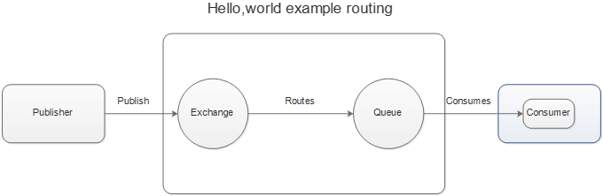
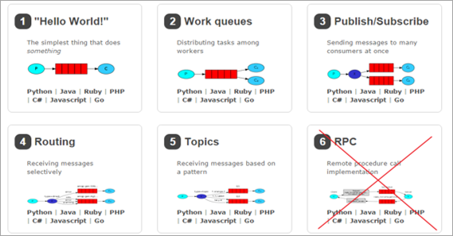
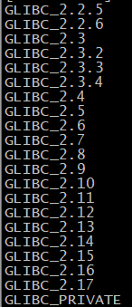
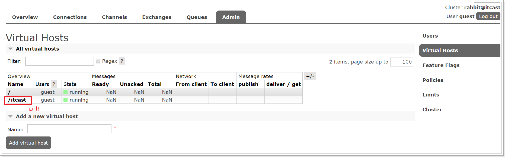

# RabbitMQ学习

## MQ的基本概念

​	1. MQ全称 **Message Queue（消息队列）**，是在消息的传输过程中保存消息的容器。多用于分布式系统之间进行通信。


​	2. MQ概述小结：

  *   MQ，消息队列，存储消息的中间件

  *   分布式系统通信两种方式：直接远程调用 和 借助第三方完成间接通信

  *   发送方称为生产者，接收方称为消费者

      

    3. MQ的优势和劣势：

* 应用解耦：提高系统容错性和可维护性
* 异步提速：提高用户体验和系统吞吐量
* 削峰填谷：提高系统稳定性
* 系统可用性降低，系统复杂度提高，一致性问题


4. AMQP

   ​	**AMQP**，即 **Advanced Message Queuing Protocol**（高级消息队列协议），是一个网络协议，是应用层协议的一个开放标准，为面向消息的中间件设计。基于此协议的客户端与消息中间件可传递消息，并不受客户端/中间件不同产品，不同的开发语言等条件的限制。2006年，AMQP 规范发布。类比HTTP。

   

5. 基础架构

   ​	2007年，Rabbit 技术公司基于 AMQP 标准开发的 RabbitMQ 1.0 发布。RabbitMQ 采用 Erlang 语言开发。Erlang 语言由 Ericson 设计，专门为开发高并发和分布式系统的一种语言，在电信领域使用广泛。

   

   

6. 相关概念

- **Broker**：接收和分发消息的应用，RabbitMQ Server就是Message Broker
- **Virtual host**：出于多租户和安全因素设计的，把AMQP的基本组件划分到一个虚拟的分组中，类似于网络中的namespace概念。当多个不同的用户使用同一个RabbitMQ server提供的服务时，可以划分出多个vhost，每个用户再自己的vhost创建exchange/queue等
- **Connection**：publisher/consumer和broker之间的TCP连接
- **Channel**：如果每一次访问RabbitMQ都建立一个Connection，在消息量大的时候建立TCP Connection的开销时巨大的，效率也较低。Channel是在Connection内部建立的逻辑连接，如果应用程序支持多线程，通常每个thread创建单独的channel进行通讯，AMQP method包含channel id帮助客户端和message broker识别channel，所以channel之间是完全隔离的。channel作为轻量级的Connection极大减少了操作系统建立TCP connection的开销
- **Exchange**：message到达broker的第一站，根据分发规则，匹配查询表中的routing key，分发消息到queue中去。常用的类型有：**direct（点到点）**，**topic（订阅发布）**，**fanout（群发）**
- **Queue**：消息最终被送到这里等待consumer取走
- **Bingding**：Exchange和Queue之间的虚拟连接，bingding中可以包含routing key。Bingding信息被保存到Exchange的查询表中，用于message的分发依据


7. 工作模式

* 简单模式
* 工作队列（work queues）
* 发布订阅模式（publish/subscribe）
* 路由模式（routing）
* 主题模式（topic）
* 远程调用模式（RPC）




8. JMS

- **JMS** 即 Java 消息服务（JavaMessage Service）应用程序接口，是一个 Java 平台中关于面向消息中间件的API
- **JMS** 是 JavaEE 规范中的一种，类比JDBC
- 很多消息中间件都实现了JMS规范，例如：ActiveMQ。RabbitMQ 官方没有提供 JMS 的实现包，但是开源社区有

## RabbitMQ的安装和配置

​	本文档只针对**CentOS7**的安装，其他操作系统请自行百度

1. 安装依赖环境

   ```shell
   yum install build-essential openssl openssl-devel unixODBC unixODBC-devel make gcc gcc-c++ kernel-devel m4 ncurses-devel tk tc xz
   ```

2. 安装Erlang

   上传erlang-18.3-1.el7.centos.x86_64.rpm，socat-1.7.3.2-5.el7.lux.x86_64.rpm，rabbitmq-server-3.6.5-1.noarch.rpm

   ```shell
   # 安装
   rpm -ivh erlang-18.3-1.el7.centos.x86_64.rpm
   ```

   如果出现以下错误

   

   说明gblic 版本太低。我们可以查看当前机器的gblic 版本

   ```
   strings /lib64/libc.so.6 | grep GLIBC
   ```

   

   当前最高版本2.12，需要2.15.所以需要升级glibc

   - 使用yum更新安装依赖

   ```shell
   sudo yum install zlib-devel bzip2-devel openssl-devel ncurses-devel sqlite-devel readline-devel tk-devel gcc make -y
   ```

   - 下载rpm包

   ```shell
   wget http://copr-be.cloud.fedoraproject.org/results/mosquito/myrepo-el6/epel-6-x86_64/glibc-2.17-55.fc20/glibc-utils-2.17-55.el6.x86_64.rpm &
   wget http://copr-be.cloud.fedoraproject.org/results/mosquito/myrepo-el6/epel-6-x86_64/glibc-2.17-55.fc20/glibc-static-2.17-55.el6.x86_64.rpm &
   wget http://copr-be.cloud.fedoraproject.org/results/mosquito/myrepo-el6/epel-6-x86_64/glibc-2.17-55.fc20/glibc-2.17-55.el6.x86_64.rpm &
   wget http://copr-be.cloud.fedoraproject.org/results/mosquito/myrepo-el6/epel-6-x86_64/glibc-2.17-55.fc20/glibc-common-2.17-55.el6.x86_64.rpm &
   wget http://copr-be.cloud.fedoraproject.org/results/mosquito/myrepo-el6/epel-6-x86_64/glibc-2.17-55.fc20/glibc-devel-2.17-55.el6.x86_64.rpm &
   wget http://copr-be.cloud.fedoraproject.org/results/mosquito/myrepo-el6/epel-6-x86_64/glibc-2.17-55.fc20/glibc-headers-2.17-55.el6.x86_64.rpm &
   wget http://copr-be.cloud.fedoraproject.org/results/mosquito/myrepo-el6/epel-6-x86_64/glibc-2.17-55.fc20/nscd-2.17-55.el6.x86_64.rpm &
   ```

   - 安装rpm包

   ```
   sudo rpm -Uvh *-2.17-55.el6.x86_64.rpm --force --nodeps
   ```

   - 安装完毕后再查看glibc版本,发现glibc版本已经到2.17了

   ```shell
   strings /lib64/libc.so.6 | grep GLIBC
   ```

   

3. 安装RabbitMQ

```sh
# 安装
rpm -ivh socat-1.7.3.2-5.el7.lux.x86_64.rpm

# 安装
rpm -ivh rabbitmq-server-3.6.5-1.noarch.rpm
```

4. 开启管理界面及配置

```
# 开启管理界面
rabbitmq-plugins enable rabbitmq_management
# 修改默认配置信息
vim /usr/lib/rabbitmq/lib/rabbitmq_server-3.6.5/ebin/rabbit.app 
# 比如修改密码、配置等等，例如：loopback_users 中的 <<"guest">>,只保留guest
```

5. 启动

```
service rabbitmq-server start # 启动服务
service rabbitmq-server stop # 停止服务
service rabbitmq-server restart # 重启服务
```

	* 设置配置文件

```shell
cd /usr/share/doc/rabbitmq-server-3.6.5/

cp rabbitmq.config.example /etc/rabbitmq/rabbitmq.config
```

6. 配置虚拟主机和用户

   6.1. 用户角色

   ​	RabbitMQ在安装好后，可以访问`http://ip地址:15672` ；其自带了guest/guest的用户名和密码；如果需要创建自定义用户；那么也可以登录管理界面后，如下操作：

   

   

   

   **角色说明**：

   1、 超级管理员(administrator)

   可登陆管理控制台，可查看所有的信息，并且可以对用户，策略(policy)进行操作。

   2、 监控者(monitoring)

   可登陆管理控制台，同时可以查看rabbitmq节点的相关信息(进程数，内存使用情况，磁盘使用情况等)

   3、 策略制定者(policymaker)

   可登陆管理控制台, 同时可以对policy进行管理。但无法查看节点的相关信息(上图红框标识的部分)。

   4、 普通管理者(management)

   仅可登陆管理控制台，无法看到节点信息，也无法对策略进行管理。

   5、 其他

   无法登陆管理控制台，通常就是普通的生产者和消费者。

   

   6.2. Virtual Hosts配置

    	像mysql拥有数据库的概念并且可以指定用户对库和表等操作的权限。RabbitMQ也有类似的权限管理；在RabbitMQ中可以虚拟消息服务器Virtual Host，每个Virtual Hosts相当于一个相对独立的RabbitMQ服务器，每个VirtualHost之间是相互隔离的。exchange、queue、message不能互通。 相当于mysql的db。Virtual Name一般以/开头。

   - 创建Virtual Hosts

   

   - 设置Virtual Host权限

   

   

   

