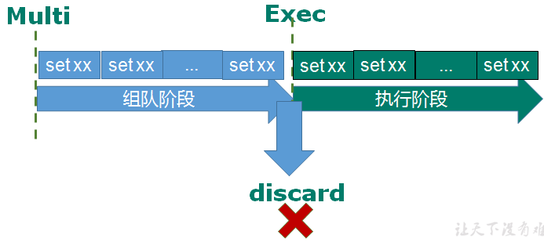
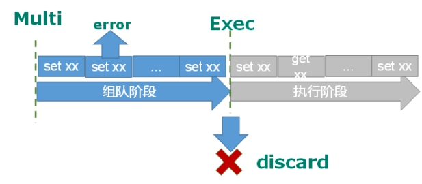
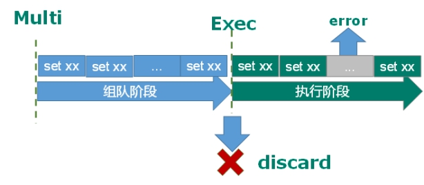

# redis

## redis概述和安装

**Redis是单线程+多路IO复用技术**

**Ø 不用考虑在windows环境下对Redis的支持**

### 安装步骤

- 下载安装最新版的gcc编译器：

  ```
  yum install centos-release-scl scl-utils-build
  
  yum install -y devtoolset-8-toolchain
  
  scl enable devtoolset-8 bash
  ```

  测试gcc版本：

  ```
  gcc --version
  ```

  

- 下载redis的压缩文件放到指定目录，redis官网：[点击这里](http://redis.io)

- 解压压缩文件：tar -zvxf redis-\*.tar.gz，解压完成后进入目录：cd redis-*

- 在redis目录下执行make命令，如果出现以下错误，请执行make distclean后，再次执行make命令。

  

- 安装目录：/user/local/bin

  

| 目录            | 描述                                                   |
| --------------- | ------------------------------------------------------ |
| redis-benchmark | 性能测试工具，可以在自己本子运行，看看自己本子性能如何 |
| redis-check-aof | 修复有问题的AOF文件                                    |
| redis-check-rdb | 修复有问题的dump.rdb文件                               |
| redis-sentinel  | redis集群使用                                          |
| redis-server    | redis服务器启动命令                                    |
| redis-cli       | 客户端、操作入口                                       |

### redis的启动

- 前台启动（不推荐）

  直接在**/usr/local/bin**目录下执行**redis-server**

- 后台启动（推荐）
  - 备份redis.conf文件到其他目录： cp /redis目录/redis版本/redis.conf /opt
  - 修改后台启动设置daemonize no 改为 yes
  - 启动redis： /usr/local/bin/redis-server /opt/redis.conf
  - 查看redis是否启动成功：ps -ef | grep redis
  - 用客户端访问redis：redis-cli
  - redis关闭：redis-cli shutdown

## redis常用五大数据类型

### redis键(key)操作

| 操作          | 描述                                                |
| ------------- | --------------------------------------------------- |
| keys *        | 查看当前库所有的key                                 |
| exists key    | 判断是否存在某个key                                 |
| type key      | 查看key的类型                                       |
| del key       | 删除key                                             |
| unlink key    | 非阻塞删除key                                       |
| expire key 10 | 给key设置过期时间（单位：秒）                       |
| ttl key       | 查看key还有多少秒过期，-1表示永不过期，-2表示已过期 |

### 字符串(String)

​	String是redis最基本的类型，一个key对应一个value，最多可以是512M。 

#### 常用命令

| 命令                                   | 描述                                                         |
| -------------------------------------- | ------------------------------------------------------------ |
| set <key> <value>                      | 添加键值对                                                   |
| set <key> <value> nx                   | 当key不存在创建                                              |
| set <key> <value> ex 10                | 设置key10秒后过期                                            |
| get <key>                              | 查询对应的键值                                               |
| incr <key>                             | 自增长1                                                      |
| desc <key>                             | 自减少1                                                      |
| incyby <key> 步长                      | 增加步长                                                     |
| descby <key> 步长                      | 减少步长                                                     |
| append k1 abc                          | 在键k1后面添加abc                                            |
| strlen k1                              | 获得k1的长度                                                 |
| mset <key1> <key2> <value1> <value2>   | 设置多个key-value                                            |
| mget <key1> <key2>                     | 获得多个值                                                   |
| msetnx <key1> <key2> <value1> <value2> | 当多个key值不存在添加键值对                                  |
| getrange  <key><起始位置><结束位置>    | 获得值的范围                                                 |
| setrange  <key><起始位置><value>       | 用 <value>  覆写<key>所储存的字符串值，从<起始位置>开始(***\*索引从0开始\****)。 |
| setex <key> <过期时间><value>          | 设置键值的同时，设置过期时间，单位秒。                       |
| getset <key><value>                    | 以新换旧，设置了新值同时获得旧值。                           |

#### 数据结构

​	String的数据结构为**简单动态字符串(Simple Dynamic String,缩写SDS)**。是可以修改的字符串，内部结构实现上类似于Java的ArrayList，采用预分配冗余空间的方式来减少内存的频繁分配。


​	如图中所示，内部为当前字符串实际分配的空间capacity一般要高于实际字符串长度len。当字符串长度小于1M时，扩容都是加倍现有的空间，如果超过1M，扩容时一次只会多扩1M的空间。需要注意的是字符串最大长度为512M。


### 列表(List)

​	Redis 列表是简单的字符串列表，按照插入顺序排序。你可以添加一个元素到列表的头部（左边）或者尾部（右边）。它的底层实际是个**双向链表**，对两端的操作性能很高，通过索引下标的操作中间的节点性能会较差。


#### 常用命令

| 操作                                       | 描述                                             |
| ------------------------------------------ | ------------------------------------------------ |
| lpush/rpush <key> <value1><value2><value3> | 从左边/右边插入一个或多个值                      |
| lpop/rpop <key>                            | 从左边/右边吐出一个值。值在键在，值光键亡。      |
| lrange <key><start><stop>                  | 按照索引下标获得元素(从左到右)                   |
| rpoplpush  <key1><key2>                    | 从<key1>列表右边吐出一个值，插到<key2>列表左边。 |
| lindex <key><index>                        | 按照索引下标获得元素(从左到右)                   |
| llen <key>                                 | 获得列表长度                                     |
| linsert <key>  before <value><newvalue>    | 在<value>的后面插入<newvalue>插入值              |
| lrem <key><n><value>                       | 从左边删除n个value(从左到右)                     |
| lset<key><index><value>                    | 将列表key下标为index的值替换成value              |

#### 数据结构

​	List的数据结构为快速链表quickList。

​	首先在列表元素较少的情况下会使用一块连续的内存存储，这个结构是ziplist，也即是压缩列表。它将所有的元素紧挨着一起存储，分配的是一块连续的内存。当数据量比较多的时候才会改成quicklist。


###  集合(set)

​	Set是string类型的无序集合。它底层其实是一个value为null的hash表，所以添加，删除，查找的**复杂度都是O(1)**。

#### 常用命令

| 操作                                         | 描述                                                         |
| -------------------------------------------- | ------------------------------------------------------------ |
| sadd <key><value1><value2> .....             | 将一个或多个 member 元素加入到集合 key 中，已经存在的 member 元素将被忽略 |
| smembers <key>                               | 取出该集合的所有值。                                         |
| sismember <key><value>                       | 判断集合<key>是否为含有该<value>值，有1，没有0               |
| scard<key>                                   | 返回该集合的元素个数。                                       |
| srem <key><value1><value2> ....              | 删除集合中的某个元素。                                       |
| spop <key>                                   | **随机从该集合中吐出一个值。**                               |
| srandmember <key><n>                         | 随机从该集合中取出n个值。不会从集合中删除 。                 |
| 随机从该集合中取出n个值。不会从集合中删除 。 | 把集合中一个值从一个集合移动到另一个集合                     |
| sinter <key1><key2>                          | 返回两个集合的交集元素。                                     |
| sunion <key1><key2>                          | 返回两个集合的并集元素。                                     |
| sdiff <key1><key2>                           | 返回两个集合的***\*差集\****元素(key1中的，不包含key2中的)   |

#### 数据结构

​	Set数据结构是dict字典，字典是用哈希表实现的。

​	Java中HashSet的内部实现使用的是HashMap，只不过所有的value都指向同一个对象。Redis的set结构也是一样，它的内部也使用hash结构，所有的value都指向同一个内部值

### 哈希(hash)

​	hash 是一个键值对集合。

#### 常用命令


| 操作                                            | 描述                                                         |
| ----------------------------------------------- | ------------------------------------------------------------ |
| hset <key><field><value>                        | 给<key>集合中的  <field>键赋值<value>                        |
| hget <key1><field>                              | 从<key1>集合<field>取出 value                                |
| hmset <key1><field1><value1><field2><value2>... | 批量设置hash的值                                             |
| hexists<key1><field>                            | 查看哈希表 key 中，给定域 field 是否存在。                   |
| hkeys <key>                                     | 列出该hash集合的所有field                                    |
| hvals <key>                                     | 列出该hash集合的所有value                                    |
| hincrby <key><field><increment>                 | 为哈希表 key 中的域 field 的值加上增量 1                     |
| hsetnx <key><field><value>                      | 将哈希表 key 中的域 field 的值设置为 value ，当且仅当域 field 不存在 |

#### 数据结构

​	Hash类型对应的数据结构是两种：ziplist（压缩列表），hashtable（哈希表）。当field-value长度较短且个数较少时，使用ziplist，否则使用hashtable。

### 有序集合(zset)

​	Redis有序集合zset与普通集合set非常相似，是一个没有重复元素的字符串集合。不同之处是有序集合的每个成员都关联了一个**评分（score）**,这个评分（score）被用来按照从最低分到最高分的方式排序集合中的成员。集合的成员是唯一的，但是评分可以是重复了 。

​	因为元素是有序的, 所以你也可以很快的根据评分（score）或者次序（position）来获取一个范围的元素。

​	访问有序集合的中间元素也是非常快的,因此你能够使用有序集合作为一个没有重复成员的智能列表。

#### 常用命令

| 操作                                                         | 描述                                                         |
| ------------------------------------------------------------ | ------------------------------------------------------------ |
| zadd  <key><score1><value1><score2><value2>…                 | 将一个或多个 member 元素及其 score 值加入到有序集 key 当中。 |
| ***\*zrange <key><start><stop>  [WITHSCORES]\****            | 返回有序集 key 中，下标在<start><stop>之间的元素，带WITHSCORES，可以让分数一起和值返回到结果集。 |
| zrangebyscore key minmax [withscores] [limit offset count]   | 返回有序集 key 中，所有 score 值介于 min 和 max 之间(包括等于 min 或 max )的成员。有序集成员按 score 值递增(从小到大)次序排列。 |
| zrevrangebyscore key maxmin [withscores] [limit offset count] | 从大到小排列。                                               |
| zincrby <key><increment><value>                              | 为元素的score加上增量                                        |
| zrem  <key><value>                                           | 删除该集合下，指定值的元素                                   |
| zcount <key><min><max>                                       | 统计该集合，分数区间内的元素个数                             |
| zrank <key><value>                                           | 返回该值在集合中的排名，从0开始。                            |

#### 数据结构

​	zset底层使用了两个数据结构

* hash，hash的作用就是关联元素value和权重score，保障元素value的唯一性，可以通过元素value找到相应的score值。
* 跳跃表，跳跃表的目的在于给元素value排序，根据score的范围获取元素列表。


## redis的发布和订阅

​	Redis 发布订阅 (pub/sub) 是一种消息通信模式：发送者 (pub) 发送消息，订阅者 (sub) 接收消息。Redis 客户端可以订阅任意数量的频道。

	### **redis的发布和订阅**


​	客户端订阅频道：


​	当这个频道发布消息后，消息就会发送给订阅的客户


### 发布订阅消息的实现

- 打开一个客户端订阅channel1：subscribe channel1


- 打开另一个客户端，给channel1发布消息hello：publish channel1 hello

  

  

  返回值是订阅者数量

- 打开第一个客户端可以看到发送的消息

  

## redis新数据类型

### bitmaps

​	位运算的字符串

​	Redis提供了Bitmaps这个“数据类型”可以实现对位的操作：

- Bitmaps本身不是一种数据类型， 实际上它就是字符串（key-value） ， 但是它可以对字符串的位进行操作。

- Bitmaps单独提供了一套命令， 所以在Redis中使用Bitmaps和使用字符串的方法不太相同。 可以把Bitmaps想象成一个以位为单位的数组， 数组的每个单元只能存储0和1， 数组的下标在Bitmaps中叫做偏移量。

#### 常用命令

| 操作                                   | 描述                                                         |
| -------------------------------------- | ------------------------------------------------------------ |
| setbit <key><offset><value>            | 设置Bitmaps中某个偏移量的值（0或1）                          |
| getbit<key><offset>                    | 获取Bitmaps中某个偏移量的值                                  |
| bitcount <key>[start end]              | 统计字符串从start字节到end字节比特值为1的数量                |
| bitop and(or/not/xor) <destkey> [key…] | bitop是一个复合操作， 它可以做多个Bitmaps的and（交集） 、 or（并集） 、 not（非） 、 xor（异或） 操作并将结果保存在destkey中。 |

### HyperLogLog

​	Redis HyperLogLog 是用来做基数统计的算法，HyperLogLog 的优点是，在输入元素的数量或者体积非常非常大时，计算基数所需的空间总是固定的、并且是很小的。因为 HyperLogLog 只会根据输入元素来计算基数，而不会储存输入元素本身，所以 HyperLogLog 不能像集合那样，返回输入的各个元素。

#### 常用命令

| 操作                                | 描述                                         |
| ----------------------------------- | -------------------------------------------- |
| pfadd <key>< element> [element ...] | 添加指定元素到 HyperLogLog 中                |
| pfcount<key> [key ...]              | 计算HLL的近似基数，可以计算多个HLL           |
| pfmerge                             | 将一个或多个HLL合并后的结果存储在另一个HLL中 |

### Geospatial

​	Redis 3.2 中增加了对GEO类型的支持。GEO，Geographic，地理信息的缩写。该类型，就是元素的2维坐标，在地图上就是经纬度。redis基于该类型，提供了经纬度设置，查询，范围查询，距离查询，经纬度Hash等常见操作。

#### 常用命令

| 操作                                                         | 描述                                       |
| ------------------------------------------------------------ | ------------------------------------------ |
| geoadd<key>< longitude><latitude><member> [longitude latitude member...] | 添加地理位置（经度，纬度，名称）           |
| geopos  <key><member> [member...]                            | 获得指定地区的坐标值                       |
| geodist<key><member1><member2>  [m\|km\|ft\|mi ]             | 获取两个位置之间的直线距离                 |
| georadius<key>< longitude><latitude>radius m\|km\|ft\|mi     | 以给定的经纬度为中心，找出某一半径内的元素 |

## redis Jedis测试

### maven导入相关依赖

```java
<dependency>
    <groupId>redis.clients</groupId>
    <artifactId>jedis</artifactId>
    <version>3.2.0</version>
</dependency>
```

### 连接时的注意事项

- 禁用linux的防火墙

  ```shell
  systemctl status firewall
  systemctl stop firewall
  ```

  测试代码详见 [jedis代码](./jedisdemo)

## redis与springboot的整合

- 导入依赖

  ```java
  <!-- redis -->
  <dependency>
      <groupId>org.springframework.boot</groupId>
      <artifactId>spring-boot-starter-data-redis</artifactId>
  </dependency>
  
  <!-- spring2.X集成redis所需common-pool2-->
  <dependency>
      <groupId>org.apache.commons</groupId>
      <artifactId>commons-pool2</artifactId>
      <version>2.6.0</version>
  </dependency>
  ```

- application.properties 配置redis

```
#Redis服务器地址
spring.redis.host=192.168.140.136
#Redis服务器连接端口
spring.redis.port=6379
#Redis数据库索引（默认为0）
spring.redis.database= 0
#连接超时时间（毫秒）
spring.redis.timeout=1800000
#连接池最大连接数（使用负值表示没有限制）
spring.redis.lettuce.pool.max-active=20
#最大阻塞等待时间(负数表示没限制)
spring.redis.lettuce.pool.max-wait=-1
#连接池中的最大空闲连接
spring.redis.lettuce.pool.max-idle=5
#连接池中的最小空闲连接
spring.redis.lettuce.pool.min-idle=0
```

- 添加redis配置类

```java
@EnableCaching
@Configuration
public class RedisConfig extends CachingConfigurerSupport {

    @Bean
    public RedisTemplate<String, Object> redisTemplate(RedisConnectionFactory factory) {
        RedisTemplate<String, Object> template = new RedisTemplate<>();
        RedisSerializer<String> redisSerializer = new StringRedisSerializer();
        Jackson2JsonRedisSerializer jackson2JsonRedisSerializer = new Jackson2JsonRedisSerializer(Object.class);
        ObjectMapper om = new ObjectMapper();
        om.setVisibility(PropertyAccessor.ALL, JsonAutoDetect.Visibility.ANY);
        om.enableDefaultTyping(ObjectMapper.DefaultTyping.NON_FINAL);
        jackson2JsonRedisSerializer.setObjectMapper(om);
        template.setConnectionFactory(factory);
        //key序列化方式
        template.setKeySerializer(redisSerializer);
        //value序列化
        template.setValueSerializer(jackson2JsonRedisSerializer);
        //value hashmap序列化
                                    		  template.setHashValueSerializer(jackson2JsonRedisSerializer);
        return template;
    }

    @Bean
    public CacheManager cacheManager(RedisConnectionFactory factory) {
        RedisSerializer<String> redisSerializer = new StringRedisSerializer();
        Jackson2JsonRedisSerializer jackson2JsonRedisSerializer = new Jackson2JsonRedisSerializer(Object.class);
        //解决查询缓存转换异常的问题
        ObjectMapper om = new ObjectMapper();
        om.setVisibility(PropertyAccessor.ALL, JsonAutoDetect.Visibility.ANY);
        om.enableDefaultTyping(ObjectMapper.DefaultTyping.NON_FINAL);
        jackson2JsonRedisSerializer.setObjectMapper(om);
        // 配置序列化（解决乱码的问题）,过期时间600秒
        RedisCacheConfiguration config = RedisCacheConfiguration.defaultCacheConfig()
                .entryTtl(Duration.ofSeconds(600))
                .serializeKeysWith(RedisSerializationContext.SerializationPair.fromSerializer(redisSerializer))
                .serializeValuesWith(RedisSerializationContext.SerializationPair.fromSerializer(jackson2JsonRedisSerializer))
                .disableCachingNullValues();
        RedisCacheManager cacheManager = RedisCacheManager.builder(factory)
                .cacheDefaults(config)
                .build();
        return cacheManager;
    }
}        
```

- 测试一下

```
@RestController
@RequestMapping("/redisTest")
public class RedisTestController {
    @Autowired
    private RedisTemplate redisTemplate;

    @GetMapping
    public String testRedis() {
        //设置值到redis
        redisTemplate.opsForValue().set("name","lucy");
        //从redis获取值
        String name = (String)redisTemplate.opsForValue().get("name");
        return name;
    }
}
```

## redis事务

​	Redis事务是一个单独的隔离操作：事务中的所有命令都会序列化、按顺序地执行。事务在执行的过程中，不会被其他客户端发送来的命令请求所打断。Redis事务的主要作用就是串联多个命令防止别的命令插队。

​	redis事务的主要命令是**multi**，**exec**，**discard**，从输入Multi命令开始，输入的命令都会依次进入命令队列中，但不会执行，直到输入Exec后，Redis会将之前的命令队列中的命令依次执行。组队过程中可以通过**discard**来放弃组队。



### 事务的错误处理

- 组队中某个命令出现了报告错误，执行时整个的所有队列都会被取消。



- 如果执行阶段某个命令报出了错误，则只有报错的命令不会被执行，而其他的命令都会执行，不会回滚。




### redis事务的三特性

- 单独的隔离操作

  ​	事务中的所有命令都会序列化、按顺序地执行。事务在执行的过程中，不会被其他客户端发送来的命令请求所打断。 

- 没有隔离级别概念

  ​	队列中的命令没有提交之前都不会实际被执行，因为事务提交前任何指令都不会被实际执行

- 不保证原子性

  ​	n 事务中如果有一条命令执行失败，其后的命令仍然会被执行，没有回滚 