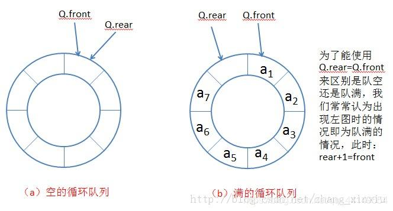

[TOC]

# 数据结构与算法

## 一. 稀疏数组

### 1. 定义

​	稀疏数组可以看做是普通数组的压缩，但是这里说的普通数组是值**无效数据量**远大于**有效数据量**的数组

​	例如：


```shell
              0 0 0 0 0 0 0 0 0 0 0
              0 0 1 0 0 0 0 0 0 0 0
              0 0 0 0 2 0 0 0 0 0 0
              0 0 0 0 0 0 0 0 0 0 0
              0 0 0 0 0 0 0 0 0 0 0
              0 0 0 0 0 0 0 0 0 0 0
              0 0 0 0 0 0 0 0 0 0 0
              0 0 0 0 0 0 0 0 0 0 0
              0 0 0 0 0 0 0 0 0 0 0
              0 0 0 0 0 0 0 0 0 0 0
              0 0 0 0 0 0 0 0 0 0 0
```

​	其稀疏数组形式：

```shell
              11 11 2
              1  2  1
              2  4  2
```

### 2. 原理

​	稀疏数组是一种压缩后的数组，为什么需要进行压缩存储呢？

- 原数组中存储了大量的无效数据，占据了大量的存储空间，真正有用的数据却很少
- 压缩存储可以节省存储空间避免资源的不必要的浪费，在数据序列化到磁盘时，压缩存储可以提高io效率

### 3. 存储方式

​	第一行存储原始数据的总行数，总列数，总的非0数据个数。

​	接下来每一行都存储非0数所在行，所在列，和具体值

​	例如：

```shell
              11 11 2
              1  2  1
              2  4  2
```

### 4. 代码实现

[点击这里](./src/com/atguigu/sparearray/SpareArray.java)

## 二. 环形队列

### 1. 定义

​	环形队列是一个首尾相连的FIFO（命名管道）的数据结构，它采用**数组的线性空间**。它能很快知道队列是否为满或者为空，也能很快的存取数据。

### 2. 原理

​	内存上没有环形结构，因此环形队列利用数组的线性空间来实现。当数据到了尾部时，它将转回到0位置来处理。这个转回操作通过**取模**来执行。

### 3. 存储方式



### 4. 代码实现

[点击这里](./src/com/atguigu/queue/QueueArray.java)


